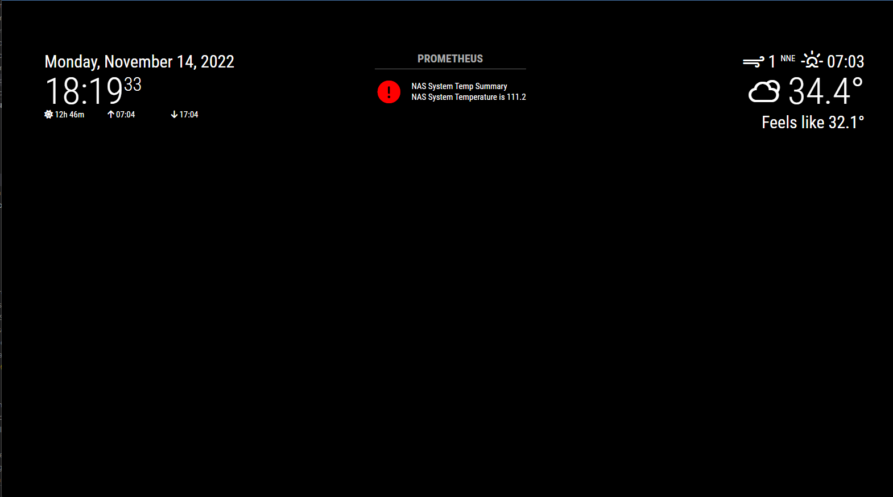

# MMM-PrometheusAlerts

A [MagicMirror²](https://magicmirror.builders) helper module to display Prometheus alerts from a Prometheus-compatible implementation.

[](https://MagicMirror.builders)
[](https://raw.githubusercontent.com/spydersoft-consulting/MMM-PrometheusAlerts/master/LICENSE)

[](https://snyk.io/test/github/spydersoft-consulting/MMM-PrometheusAlerts)



## Installation

In your terminal, go to your MagicMirror's Module folder:

```bash
cd ~/MagicMirror/modules
```

Clone this repository:

```bash
git clone https://github.com/spydersoft-consulting/MMM-PrometheusAlerts.git
```

Go to the modules folder:

```bash
cd MMM-PrometheusAlerts
```

Install the dependencies and transpile the Typescript:

```bash
npm install
```

Add the module to the modules array in the `config/config.js` file:

```javascript
    {
        module: 'MMM-PrometheusAlerts'
    },
```

## Config Options

| **Option**         | **Default**     | **Description**                                                               |
| ------------------ | --------------- | ----------------------------------------------------------------------------- |
| `prometheusUrl`    | ''              | The URL of the Prometheus Instance.                                           |
| `animationSpeed`   | 3000            | **Optional** The speed of the show and hide animations in milliseconds        |
| `useHeader`        | `true`          | **Optional** Whether or not to show the header                                |
| `maxWidth`         | `300px`         | **Optional** The maximum width for this module                                |
| `initialLoadDelay` | `3250`          | **Optional** How long to wait, in milliseconds, before the first status check |
| `updateInterval`   | `2 * 60 * 1000` | **Optional** How often to check the status (defaults to 2 minutes)            |

## Config Examples

### Minimal Configuration

```javascript
    {
      module: "MMM-PrometheusAlerts",
      position: "bottom_right",
      config: {
        prometheusUrl: "https//prometheus.mydomain.com"
      }
    },
```

## Updating

To update the module to the latest version, use your terminal to go to your MMM-PrometheusAlerts module folder and type the following command:

```bash
git pull
npm install
```

If you haven't changed the modules, this should work without any problems.
Type `git status` to see your changes, if there are any, you can reset them with `git reset --hard`. After that, git pull should be possible.

## Contributing

Please read the [Contribution Guide](CONTRIBUTING.md) for details on contributing to the project.
