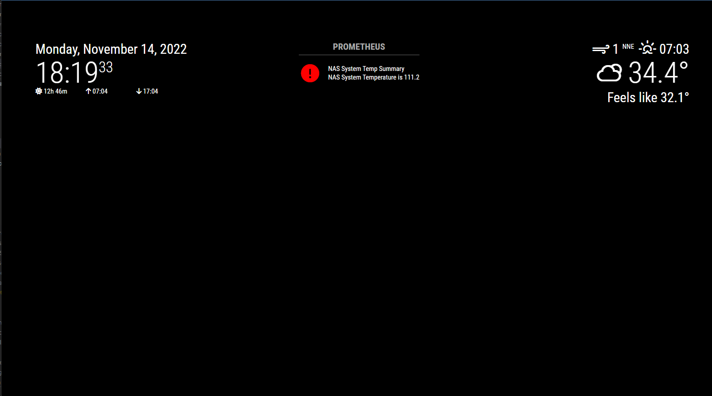

# MMM-PrometheusAlerts

A [MagicMirror²](https://magicmirror.builders) helper module to display Prometheus alerts from a Prometheus-compatible implementation.

[](https://MagicMirror.builders)
[](https://raw.githubusercontent.com/spydersoft-consulting/MMM-PrometheusAlerts/master/LICENSE)

[](https://snyk.io/test/github/spydersoft-consulting/MMM-PrometheusAlerts)



## Installation

In your terminal, go to your MagicMirror's Module folder:

```bash
cd ~/MagicMirror/modules
```

Clone this repository:

```bash
git clone https://github.com/spydersoft-consulting/MMM-PrometheusAlerts.git
```

Go to the modules folder:

```bash
cd MMM-PrometheusAlerts
```

Install the dependencies and transpile the Typescript:

```bash
npm install
```

Add the module to the modules array in the `config/config.js` file:

```javascript
    {
        module: 'MMM-PrometheusAlerts'
    },
```

## Config Options

| **Option**         | **Default**     | **Description**                                                                                                                            |
| ------------------ | --------------- | ------------------------------------------------------------------------------------------------------------------------------------------ |
| `instances`        | `[]`            | An array of Prometheus instances to query. Each instance should have a `url` property and optionally `headers` for custom request headers. |
| `updateInterval`   | `2 * 60 * 1000` | **Optional** How often to check the status across all instances (defaults to 2 minutes)                                                    |
| `animationSpeed`   | 3000            | **Optional** The speed of the show and hide animations in milliseconds                                                                     |
| `useHeader`        | `true`          | **Optional** Whether or not to show the header                                                                                             |
| `maxWidth`         | `300px`         | **Optional** The maximum width for this module                                                                                             |
| `initialLoadDelay` | `3250`          | **Optional** How long to wait, in milliseconds, before the first status check                                                              |

### Instance Configuration

Each instance in the `instances` array supports:

| **Property** | **Type**                 | **Required** | **Description**                                                             |
| ------------ | ------------------------ | ------------ | --------------------------------------------------------------------------- |
| `url`        | `string`                 | Yes          | The URL of the Prometheus instance                                          |
| `headers`    | `Record<string, string>` | No           | Custom headers to include in requests (e.g., `{"X-Scope-OrgId": "team-a"}`) |

### Grafana-Managed Alerts

Alerts managed and evaluated by Grafana itself (rather than proxied from a Prometheus/Mimir data source) can also be
displayed, since Grafana exposes a Prometheus-compatible endpoint for its own alert rules at
`<grafana-url>/api/prometheus/grafana/api/v1/alerts`. Point an instance's `url` at that base path and pass a Grafana
service account token in `headers`:

```javascript
{
  url: "https://grafana.mydomain.com/api/prometheus/grafana",
  headers: {
    Authorization: "Bearer <grafana-service-account-token>"
  }
}
```

Grafana returns every configured rule on every poll (not just actively firing/pending ones), with a wider set of
states than plain Prometheus, e.g. `Normal`, `Alerting`, `Pending`, optionally suffixed with a health flag such as
`Normal (NoData)` or `Alerting (Error)`. This module normalizes those states and only displays rules that are
actively `Alerting` (shown as firing) or `Pending`; rules in the `Normal` state are filtered out, matching how a
native Prometheus `/api/v1/alerts` endpoint behaves.

## Config Examples

### Minimal Configuration

```javascript
    {
      module: "MMM-PrometheusAlerts",
      position: "bottom_right",
      config: {
        instances: [
          {
            url: "https://prometheus.mydomain.com"
          }
        ]
      }
    },
```

### Multiple Instances with Custom Headers

```javascript
    {
      module: "MMM-PrometheusAlerts",
      position: "bottom_right",
      config: {
        instances: [
          {
            url: "https://prometheus-team-a.mydomain.com",
            headers: {
              "X-Scope-OrgId": "team-a"
            }
          },
          {
            url: "https://prometheus-team-b.mydomain.com",
            headers: {
              "X-Scope-OrgId": "team-b",
              "Authorization": "Bearer my-token"
            }
          }
        ],
        updateInterval: 60000, // Check every minute
        useHeader: true,
        maxWidth: "400px"
      }
    },
```

## Updating

To update the module to the latest version, use your terminal to go to your MMM-PrometheusAlerts module folder and type the following command:

```bash
git pull
npm install
```

If you haven't changed the modules, this should work without any problems.
Type `git status` to see your changes, if there are any, you can reset them with `git reset --hard`. After that, git pull should be possible.

### Breaking Changes - Migration Guide

**Version 2.0+ introduces a new configuration structure** to support multiple Prometheus instances. If you're upgrading from an earlier version, you'll need to update your config:

**Old Configuration (v1.x):**

```javascript
{
  module: "MMM-PrometheusAlerts",
  position: "bottom_right",
  config: {
    prometheusUrl: "https://prometheus.mydomain.com",
    updateInterval: 120000
  }
}
```

**New Configuration (v2.0+):**

```javascript
{
  module: "MMM-PrometheusAlerts",
  position: "bottom_right",
  config: {
    instances: [
      {
        url: "https://prometheus.mydomain.com"
      }
    ],
    updateInterval: 120000
  }
}
```

**Key Changes:**

- `prometheusUrl` is now `url` inside an `instances` array
- `updateInterval` moved from per-instance to a global configuration
- Added support for custom `headers` per instance (optional)

## Contributing

Please read the [Contribution Guide](CONTRIBUTING.md) for details on contributing to the project.
